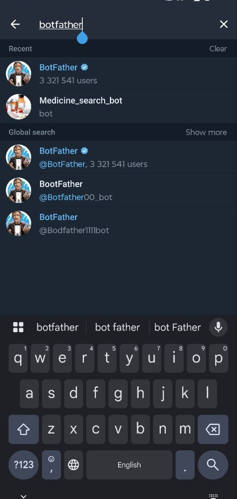
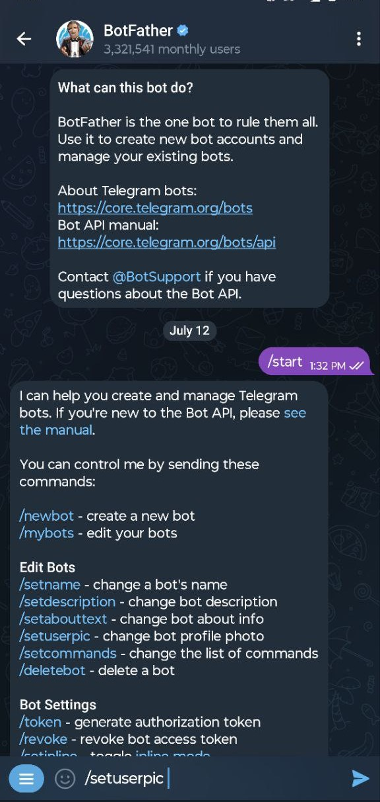
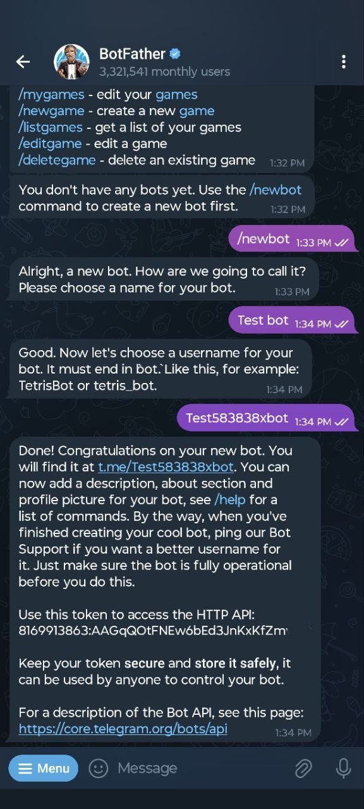
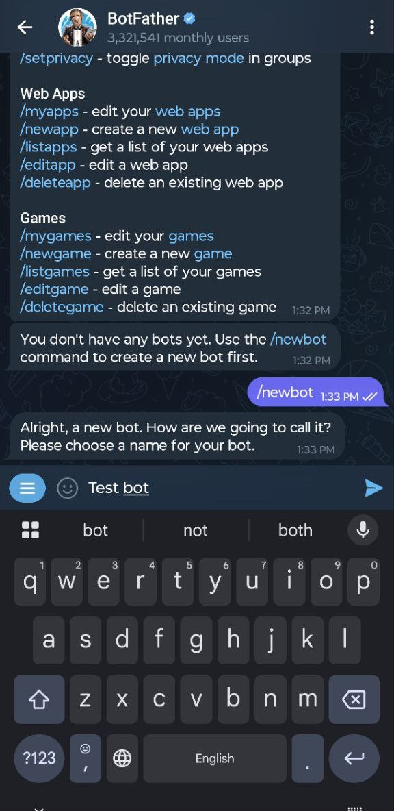

# Create Your First Telegram Bot: A Beginner's Tutorial

This repository provides a complete, step-by-step guide to creating your very first Telegram bot using Python. We'll build a simple "Echo Bot" that replies to every message with the same text. It's the perfect project for beginners to get started with bot development.

## What You'll Build

You will create a simple Telegram bot that:
- Responds to a `/start` command with a welcome message.
- Responds to a `/help` command with a helpful text.
- Echoes back any text message it receives.

## Getting Started: A Step-by-Step Guide

Follow these instructions to get your first bot running.

### 1. Prerequisites

- Python 3.8 or higher.
- A Telegram account.
- Git installed on your local machine.

### 2. Clone the Repository

First, clone this repository to your local machine:

```bash
git clone https://github.com/zenitsu0509/TeleBot-Creator.git
cd TeleBot-Creator
```

### 3. Create a Telegram Bot with BotFather

To use the Telegram Bot API, you need to create a bot via **BotFather**, a bot provided by Telegram to help developers create and manage their bots.

**Step 1: Find BotFather**
Open your Telegram app and search for `@BotFather`.



**Step 2: Start a chat**
Start a chat with BotFather and send the `/start` command.



**Step 3: Create a new bot**
Send the `/newbot` command. BotFather will ask you for a name and a username for your bot.



**Step 4: Get your Bot Token**
Once you've chosen a name and username, BotFather will provide you with a **token**. This token is your bot's authentication key. **Keep it safe and do not share it.**



### 4. Set Up Your Environment

**Step 1: Install Dependencies**
Install the necessary Python package using the `requirements.txt` file.

```bash
pip install -r requirements.txt
```

**Step 2: Create a `.env` file**
Create a file named `.env` in the root of the project directory. This file will store your secret bot token.

```
TELEGRAM_BOT_TOKEN="YOUR_TELEGRAM_BOT_TOKEN"
```

Replace `"YOUR_TELEGRAM_BOT_TOKEN"` with the token you got from BotFather.

### 5. Understand the Code (`bot.py`)

The `bot.py` file contains all the logic for your bot. Here's a quick breakdown:
- **`start()`**: This function is called when a user sends the `/start` command. It replies with a friendly welcome message.
- **`help_command()`**: This function is called for the `/help` command and explains what the bot does.
- **`echo()`**: This function is the core of our bot. It takes any text message the user sends and replies with the exact same text.
- **`main()`**: This function sets up all the command handlers and starts the bot, making it listen for messages.

### 6. Run the Bot

Now you are ready to start your bot!

```bash
python bot.py
```

If everything is configured correctly, you will see the message "Bot is running... Press Ctrl-C to stop." in your terminal. You can now go to your bot on Telegram and start sending it messages!

## Project Structure

```bash
TeleBot-Creator/
├── .env                # Stores your secret bot token (you need to create this)
├── bot.py              # The main Python script for your bot
├── LICENSE
├── README.md           # This file
├── requirements.txt    # Python dependencies
└── data/
    └── image/          # Screenshots for the tutorial
```

## Contributing

Contributions are welcome! If you have ideas for new features or improvements, feel free to open an issue or submit a pull request.

## License

This project is licensed under the MIT License. See the `LICENSE` file for details.
